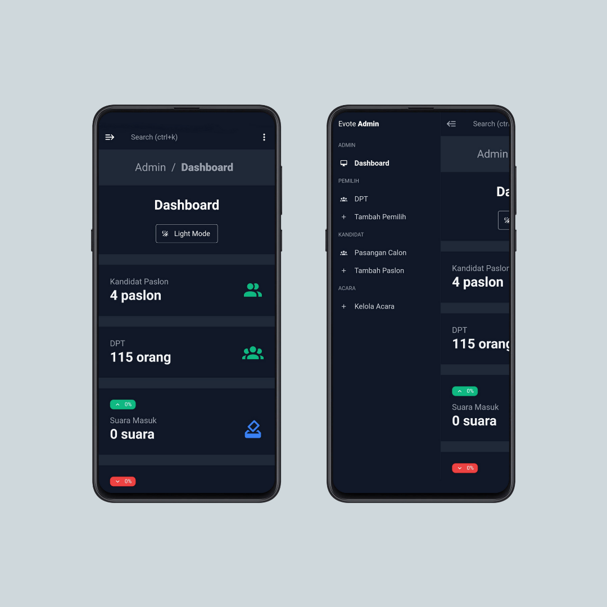

### Electroic Vote System
Studi kasus : HIMA Teknik Informatika Politeknik Hansur

---

## About

Electronic Vote System atau **EVoting** adalah sistem pemungutan suara elektronik berbasis website yang dibangun untuk mempermudah kegiatan pemilihan ketua dan wakil ketua umum HIMA TI Polihasnur yang sebelumnya masih menggunakan Google Form

Sistem ini dibangun menggunakan framework Vue JS dan Tailwind dalam pengembangan aplikasi disisi client dan untuk disisi server atau backend sistem ini dibangun menggunakan Node JS, framework Express JS, dan MySQL sebagai DBMS serta bebrapa module tambahan lainnya seperti JWT dan lain - lain 

Sistem ini dibangun terdiri atas tiga buah aplikasi yang memiliki fungsi masing - masing diantaranya adalah :

- **Evote admin**
	 adalah aplikasi yang khusus digunakan oleh administrator atau pihak yang memiliki wewenang dalam melakukan monitoring dan menjalankan setiap fungsi pada aplikasi

- **Evote Client**
	 adalah aplikasi yang khusus digunakan oleh para pemilih yang telah memiliki akses berupa username dan password yang sudah terdaftar didalam sistem

- **Evote API**
	 adalah aplikasi server atau REST API khusus yang digunakan untuk menghubungkan aplikasi client dan admin ke database maupun server

## Case study

Studi kasus yang ada pada aplikasi ini adalah berawal dari keikutsertaan saya dalam kepengurusan HIMA TI Polihasnur tahun 2020 yang mana pada saat itu belum memiliki sistem evoting mereka sendiri dan masih mengandalkan layanan Google Form.

Saya mendapati banyak faktor yang menyebabkan HIMA TI Polihasnur saat itu belum memiliki sistem evoting mereka sendiri, yaitu :

- **Kualitas dan kuantittas SDM**
		Menurut pengamatan saya inilah faktor paling berdampak karena jika SDM yang dimiliki sedikit ditambah dengan hardskill yang bisa dikatak kurang mempuni akan sulit untuk memulai pengembangan sistem evoting sendiri

- **Bukan prioritas program kerja**
- **Berada pada zona nyaman ketika menggunakan layanan Google Form**

### Solutions

Dari studi kasus diatas saya memiliki solusi untuk mengembangkan sistem evoting yang mudah dimaintenance serta mudah dikembangkan

### Development flow

Dalam perancangan saya memecah sistem ini menjadi tiga aplikasi yang berdiri sendiri, bertujuan untuk memudahkan ketika dilakukan maintenance mauppun menambahkan fitur baru kedalam salah satu aplikasi

Adapun urutan pengembangan aplikasi ini adalah sebagai berikut :

- Tahap 1 : Evote Client
	- Wireframing aplikasi evote client
	- Convert wireframe sebagai final design concept evote client
	- Slicing design kedalam real interface
	- Merancang structure database
	- Membuat flowchart dan DFD dari rancangan aplikasi evote api
	- Mengembangkan evote api untuk keperluan evote client   

- Tahap 2 : Evote Admin
	- Searching tempalate admin yang sesuai
	- Mengembangkan evote admin berdasarkan kebutuhan 
	- Mengembangkan evote api untuk keperluan evote admin

## Documentation application

### Evote client 

Untuk instalasi dan dokumentasi applikasi silahkan kunjungi github repository evote-client [disini](https://github.com/or-abdillh/evote-client.git)

### Evote admin

Untuk instalasi dan dokumentasi applikasi silahkan kunjungi github repository evote-admin [disini](https://github.com/or-abdillh/evote-admin.git)

## Evote REST API

Untuk dokumentasi lengkap tentang endpoint, request, response, dan lain - lain silahkan kunjungi github repository evote-api-v2 [disini](https://github.com/or-abdillh/evote-api-v2.git)

## Features

Berikut ini adalah fitur - fitur yang ada pada sistem ini sampai dengan dokumentasi ini dibuat :

[x] Using JWT authentication
[x] login using username and password
[x] Create new account
[x] Update account
[x] Remove account
[x] Get profile detail for spesific account
[x] Submit vote
[x] Using passcode validation at client app before submit vote
[x] Create new candidate
[x] Update candidate
[x] Remove candidate
[x] Manage event details
[x] Get information detail about event fo admin
[x] Get information about quiick count
[ ] Upload image profile for candidates
[ ] Insert data account using spreadsheet .xls or .xlsx
[ ] Download document report event

## Install

Untuk menggunakan sistem ini anda harus mengunduh ketiga aplikasi yang sudah saya asebutkan sebelumnya terlebih dulu dengan mengikutin instruksi pada setiap dokumentasi

## Conclusion

Saya berharap dengan adanya sistem ini dapat menjadi solusi dari permasalahan yang sering dijumpai pada skema voting manual pada umumnya

Masih banyak fitur yang belum bisa disematkan pada sistem ini, maka dari itu saya berkomitmen untuk melakukan pengembangan yang lebih lagi terhadap sistem ini

Segala masukan dan saran terhadap sistem ini sangat - sangat dibutuhkan untuk memnduung siklus pengembangan yang positif dan berkelanjutan kedepannya

## Note

Sistem ini sudah digunakan dan berjalan lancar pada saat Pemilihan Ketua dan Wakil Ketua Umum HIMA TI Polihhasnur pada Sidang Istimewa HIMA TI Polihasnur yang diselenggarakan pada akhir bulan desember tahun 2021 yang lalu

Tercatat ada 154 DPT atau akun pemilih yang terdaftar didalam sistem serta terdapat 4 calon pasangan yang bersaing

## Thanks 
- Support me with a cup of coffee and other snacks [here ..](https://saweria.co/orabdillh)
- Don't forget to give me star in this repository 🙏🏻🙏🏻
- See my other projects on instagram [@or.abdillh](http://www.instagram.com/or.abdillh)

[Oka R Abdillah ](http://github.com/or-abdillh)
 
Last edited on : 21/02/2022
